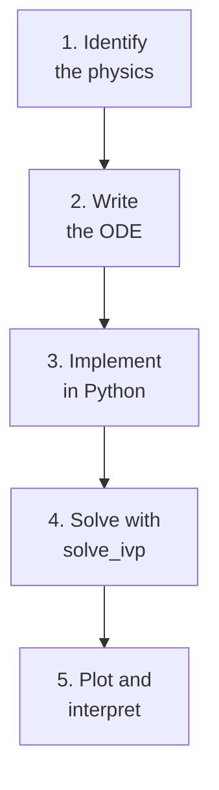

import ModelingSimulationComments from '../../../../components/modeling-and-simulation/ModelingSimulationComments.astro';
import TawkWidget from '../../../../components/TawkWidget.astro';
import UniversalContentContributors from '../../../../components/UniversalContentContributors.astro';
import InArticleAd from '../../../../components/InArticleAd.astro';
import Copyright from '../../../../components/Copyright.astro';
import BionicText from '../../../../components/BionicText.astro';
import TailwindWrapper from '../../../../components/TailwindWrapper.jsx';
import { Tabs, TabItem } from '@astrojs/starlight/components';
import { Card, CardGrid, Badge, Steps, LinkButton, FileTree } from '@astrojs/starlight/components';

<UniversalContentContributors 
  contributors={frontmatter.contributors}
/>


Every engineering simulation follows the same pattern: write the physics as equations, turn those equations into code, hand them to a numerical solver, and interpret the plots. In this lesson you will learn that pattern by building a battery discharge simulator that predicts the runtime of a lithium cell under a realistic load profile. By the end, you will have a working Python script and a clear understanding of how SciPy's `solve_ivp` works. #Simulation #Python #BatteryModeling

## What We Are Building

<Card title="Battery Discharge Simulator" icon="star">
A Python script that models a single lithium-ion cell (3.0 V to 4.2 V range, 3000 mAh capacity). You define a load current profile, and the simulator predicts voltage vs. time, state of charge vs. time, and total runtime before the cell hits its cutoff voltage.
</Card>

**Project specifications:**

| Parameter | Value |
|-----------|-------|
| Cell Chemistry | Lithium-ion (single cell) |
| Nominal Voltage | 3.7 V |
| Full Charge Voltage | 4.2 V |
| Cutoff Voltage | 3.0 V |
| Capacity | 3000 mAh (3.0 Ah) |
| Load Profile | Variable (standby + active bursts) |
| Solver | SciPy `solve_ivp` (RK45) |
| Output | Voltage vs. time plot, SOC vs. time plot, predicted runtime |

## The Simulation Workflow

<InArticleAd />


Before we dive into batteries, let's establish the general pattern that every simulation in this course will follow.



<Steps>

1. **Identify the physics**

   What are the governing equations? For a battery, we need the relationship between voltage, state of charge, and current draw.

2. **Write the ODE**

   Express the system as a set of first-order ordinary differential equations (ODEs) in the form $\dot{y} = f(t, y)$.

3. **Implement in Python**

   Write a function that takes time `t` and state vector `y`, and returns the derivative `dydt`.

4. **Solve with `solve_ivp`**

   Hand your function to SciPy's solver. Specify initial conditions, time span, and any events (like "stop when voltage hits 3.0 V").

5. **Plot and interpret**

   Visualize the results. Extract engineering quantities (runtime, peak temperature, settling time, etc.).

</Steps>

## Setting Up Your Environment

<InArticleAd />


You need Python 3.8 or later with three packages:

```bash
pip install numpy scipy matplotlib
```

Verify the installation:

```python
import numpy as np
import scipy
import matplotlib
print(f"NumPy:      {np.__version__}")
print(f"SciPy:      {scipy.__version__}")
print(f"Matplotlib: {matplotlib.__version__}")
```

That is all the software you need for this entire course.

## Battery Discharge Physics

<InArticleAd />


### The Voltage-SOC Relationship

A lithium-ion cell does not have a constant voltage. As it discharges, the open-circuit voltage (OCV) drops following a characteristic curve that depends on the state of charge (SOC). The SOC is simply the fraction of remaining capacity:

$$
\text{SOC}(t) = 1 - \frac{1}{Q} \int_0^t I(\tau) \, d\tau
$$

where $Q$ is the total capacity in ampere-hours and $I(t)$ is the discharge current.

As a differential equation:

$$
\frac{d(\text{SOC})}{dt} = -\frac{I(t)}{Q}
$$

For the math behind solving ordinary differential equations like this one, see [Applied Mathematics: Differential Equations in Real Systems](/education/applied-mathematics/differential-equations-real-systems/).

This is the ODE we will solve. The current $I(t)$ is our input (the load profile), and the SOC is our state variable.

### Modeling the Open-Circuit Voltage

Real lithium cells have a voltage curve that is relatively flat in the middle and drops steeply near empty. A common empirical model uses a polynomial fit:

$$
V_{\text{OCV}}(\text{SOC}) = a_0 + a_1 \cdot \text{SOC} + a_2 \cdot \text{SOC}^2 + a_3 \cdot \text{SOC}^3
$$

We will use coefficients that approximate a typical 18650 cell:

```text
Voltage vs. SOC (approximate shape)

  4.2 V |          .........
        |        ..
  3.7 V |  .....
        | .
  3.0 V |.
        +--------------------
        0%    50%    100%  SOC
```

### Internal Resistance

The terminal voltage under load is lower than the OCV due to internal resistance:

$$
V_{\text{terminal}} = V_{\text{OCV}}(\text{SOC}) - I(t) \cdot R_{\text{internal}}
$$

For a typical 18650 cell, $R_{\text{internal}} \approx 0.05 \, \Omega$.

## The Load Profile

<InArticleAd />


Instead of a constant current draw, let's model something realistic: an IoT sensor node that sleeps most of the time and wakes up periodically to take measurements and transmit data.

```text
Current draw over time (repeating pattern)

  500 mA |    ___          ___
         |   |   |        |   |
  10 mA  |___|   |________|   |____
         |
         +---------------------------
           0s   2s   10s   12s   20s

         Sleep: 10 mA for 8 seconds
         Active: 500 mA for 2 seconds
         Cycle: 10 seconds
         Average: 108 mA
```

## Complete Python Code

<InArticleAd />


Here is the full battery discharge simulator. Save it as `battery_simulator.py` and run it.

```python
"""
Battery Discharge Simulator
Models a lithium-ion cell under a variable load profile.
Predicts voltage, SOC, and runtime.
"""

import numpy as np
from scipy.integrate import solve_ivp
import matplotlib.pyplot as plt

# -------------------------------------------------------
# Cell parameters
# -------------------------------------------------------
CAPACITY_AH = 3.0          # Cell capacity in Ah
R_INTERNAL = 0.05          # Internal resistance in ohms
V_CUTOFF = 3.0             # Cutoff voltage in V

# OCV polynomial coefficients (fit to a typical 18650 curve)
# V_ocv(SOC) = a0 + a1*SOC + a2*SOC^2 + a3*SOC^3
OCV_COEFFS = [3.0, 0.55, 0.95, -0.30]

def ocv_from_soc(soc):
    """Open-circuit voltage as a function of state of charge."""
    a = OCV_COEFFS
    soc_clipped = np.clip(soc, 0.0, 1.0)
    return a[0] + a[1]*soc_clipped + a[2]*soc_clipped**2 + a[3]*soc_clipped**3

def terminal_voltage(soc, current_a):
    """Terminal voltage under load (OCV minus resistive drop)."""
    return ocv_from_soc(soc) - current_a * R_INTERNAL

# -------------------------------------------------------
# Load profile
# -------------------------------------------------------
SLEEP_CURRENT_A = 0.010    # 10 mA during sleep
ACTIVE_CURRENT_A = 0.500   # 500 mA during active burst
ACTIVE_DURATION_S = 2.0    # Active burst lasts 2 seconds
CYCLE_PERIOD_S = 10.0      # One full sleep+active cycle

def load_current(t):
    """
    Returns the load current in amperes at time t (seconds).
    Repeating pattern: active burst for ACTIVE_DURATION_S,
    then sleep for the remainder of the cycle.
    """
    phase = t % CYCLE_PERIOD_S
    if phase < ACTIVE_DURATION_S:
        return ACTIVE_CURRENT_A
    else:
        return SLEEP_CURRENT_A

# -------------------------------------------------------
# ODE: dSOC/dt = -I(t) / (Q * 3600)
# Note: Q is in Ah, t is in seconds, so we divide by 3600
# -------------------------------------------------------
def battery_ode(t, y):
    """State equation for battery discharge."""
    soc = y[0]
    current = load_current(t)
    dsoc_dt = -current / (CAPACITY_AH * 3600.0)
    return [dsoc_dt]

# -------------------------------------------------------
# Event: stop when terminal voltage hits cutoff
# -------------------------------------------------------
def voltage_cutoff_event(t, y):
    """Returns zero when terminal voltage reaches V_CUTOFF."""
    soc = y[0]
    current = load_current(t)
    v_term = terminal_voltage(soc, current)
    return v_term - V_CUTOFF

voltage_cutoff_event.terminal = True
voltage_cutoff_event.direction = -1

# -------------------------------------------------------
# Run the simulation
# -------------------------------------------------------
def run_simulation():
    """Simulate battery discharge and plot results."""

    soc_initial = 1.0       # Start fully charged
    t_max = 200000.0        # Maximum simulation time (seconds)

    print("=" * 55)
    print("  BATTERY DISCHARGE SIMULATOR")
    print("=" * 55)
    print(f"  Cell capacity:       {CAPACITY_AH:.1f} Ah ({CAPACITY_AH*1000:.0f} mAh)")
    print(f"  Internal resistance: {R_INTERNAL*1000:.0f} mohm")
    print(f"  Cutoff voltage:      {V_CUTOFF:.1f} V")
    print(f"  Sleep current:       {SLEEP_CURRENT_A*1000:.0f} mA")
    print(f"  Active current:      {ACTIVE_CURRENT_A*1000:.0f} mA")
    print(f"  Duty cycle:          {ACTIVE_DURATION_S/CYCLE_PERIOD_S*100:.0f}%")
    avg_current = (ACTIVE_CURRENT_A * ACTIVE_DURATION_S +
                   SLEEP_CURRENT_A * (CYCLE_PERIOD_S - ACTIVE_DURATION_S)) / CYCLE_PERIOD_S
    print(f"  Average current:     {avg_current*1000:.0f} mA")
    print("-" * 55)

    # Solve the ODE
    sol = solve_ivp(
        battery_ode,
        t_span=[0, t_max],
        y0=[soc_initial],
        events=voltage_cutoff_event,
        max_step=1.0,        # Sample at least every 1 second
        dense_output=True
    )

    # Generate smooth time vector for plotting
    t_end = sol.t[-1]
    t_plot = np.linspace(0, t_end, 2000)
    soc_plot = sol.sol(t_plot)[0]

    # Compute voltage at each time point
    v_plot = np.array([terminal_voltage(s, load_current(t))
                       for s, t in zip(soc_plot, t_plot)])

    # Compute current at each time point (for reference)
    i_plot = np.array([load_current(t) for t in t_plot])

    # Convert time to hours for plotting
    t_hours = t_plot / 3600.0

    # Print results
    runtime_hours = t_end / 3600.0
    final_soc = soc_plot[-1]
    print(f"  Predicted runtime:   {runtime_hours:.1f} hours")
    print(f"  Final SOC:           {final_soc*100:.1f}%")
    print(f"  Final voltage:       {v_plot[-1]:.2f} V")

    # Simple estimate for comparison
    simple_hours = CAPACITY_AH / avg_current
    print(f"  Simple estimate:     {simple_hours:.1f} hours (capacity / avg current)")
    print(f"  Difference:          {abs(runtime_hours - simple_hours):.1f} hours")
    print("=" * 55)

    # -------------------------------------------------------
    # Plot results
    # -------------------------------------------------------
    fig, axes = plt.subplots(3, 1, figsize=(10, 8), sharex=True)
    fig.suptitle("Battery Discharge Simulation", fontsize=14, fontweight="bold")

    # Plot 1: Terminal voltage
    axes[0].plot(t_hours, v_plot, color="tab:blue", linewidth=1.5)
    axes[0].axhline(y=V_CUTOFF, color="red", linestyle="--", alpha=0.7,
                     label=f"Cutoff ({V_CUTOFF} V)")
    axes[0].set_ylabel("Terminal Voltage (V)")
    axes[0].set_ylim([2.8, 4.4])
    axes[0].legend(loc="upper right")
    axes[0].grid(True, alpha=0.3)

    # Plot 2: State of charge
    axes[1].plot(t_hours, soc_plot * 100, color="tab:green", linewidth=1.5)
    axes[1].set_ylabel("State of Charge (%)")
    axes[1].set_ylim([-5, 105])
    axes[1].grid(True, alpha=0.3)

    # Plot 3: Load current
    # Downsample for current plot (it's a square wave)
    t_current = np.linspace(0, min(t_end, 60), 1000)  # Show first 60 seconds
    i_current = np.array([load_current(t) * 1000 for t in t_current])
    axes[2].plot(t_current, i_current, color="tab:orange", linewidth=1.0)
    axes[2].set_ylabel("Load Current (mA)")
    axes[2].set_xlabel("Time (seconds, first 60 s shown)")
    axes[2].set_ylim([-50, 600])
    axes[2].grid(True, alpha=0.3)

    plt.tight_layout()
    plt.savefig("battery_discharge.png", dpi=150, bbox_inches="tight")
    plt.show()
    print("\nPlot saved as battery_discharge.png")

if __name__ == "__main__":
    run_simulation()
```

## Running the Simulator

<InArticleAd />


Save the code above and run it:

```bash
python battery_simulator.py
```

You should see output like this:

```text
=======================================================
  BATTERY DISCHARGE SIMULATOR
=======================================================
  Cell capacity:       3.0 Ah (3000 mAh)
  Internal resistance: 50 mohm
  Cutoff voltage:      3.0 V
  Sleep current:       10 mA
  Active current:      500 mA
  Duty cycle:          20%
  Average current:     108 mA
-------------------------------------------------------
  Predicted runtime:   26.8 hours
  Final SOC:           3.2%
  Final voltage:       3.00 V
  Simple estimate:     27.8 hours (capacity / avg current)
  Difference:          1.0 hours
=======================================================
```

The simulation predicts about 26.8 hours of runtime, while the naive calculation (capacity divided by average current) gives 27.8 hours. The difference comes from the fact that the simulation accounts for internal resistance losses and the nonlinear voltage curve, which causes the cutoff to trigger before the cell is completely empty.

## Understanding `solve_ivp`

<InArticleAd />


The core of every simulation in this course is SciPy's `solve_ivp` function. Let's break down how we used it.

<Tabs>
  <TabItem label="The ODE Function">

The function you pass to `solve_ivp` must have this signature:

```python
def battery_ode(t, y):
    soc = y[0]               # Unpack state variables
    current = load_current(t) # External input
    dsoc_dt = -current / (CAPACITY_AH * 3600.0)
    return [dsoc_dt]          # Return derivatives
```

The solver calls this function repeatedly at different time points. Each call returns the rate of change of the state variables. The solver uses these rates to step forward in time.

Key rules:
- `t` is a scalar (the current time)
- `y` is a 1D array of state variables
- Return a list or array of the same length as `y`
- The function must be deterministic (same inputs produce same outputs)

</TabItem>

  <TabItem label="Events">

Events let you stop the simulation when a condition is met:

```python
def voltage_cutoff_event(t, y):
    soc = y[0]
    current = load_current(t)
    v_term = terminal_voltage(soc, current)
    return v_term - V_CUTOFF  # Zero-crossing triggers event

voltage_cutoff_event.terminal = True   # Stop the solver
voltage_cutoff_event.direction = -1    # Only when decreasing
```

The solver watches for the return value to cross zero. When `terminal=True`, it stops the integration at that exact moment. The `direction=-1` means it only triggers when the value goes from positive to negative (voltage falling below cutoff).
  </TabItem>

  <TabItem label="Dense Output">

Setting `dense_output=True` gives you a continuous solution you can evaluate at any time:

```python
sol = solve_ivp(..., dense_output=True)

# Evaluate at arbitrary time points
t_plot = np.linspace(0, sol.t[-1], 2000)
soc_plot = sol.sol(t_plot)[0]
```

Without dense output, you only get the solver's internal time steps, which may be unevenly spaced. Dense output lets you create smooth plots at any resolution you want.
  </TabItem>
</Tabs>

## Experiments to Try

<InArticleAd />


Now that you have a working simulator, change some parameters and see what happens.

<CardGrid>
  <Card title="Increase Active Current" icon="warning">
  Change `ACTIVE_CURRENT_A` to `1.0` (1 A bursts). How much does the runtime drop? Notice that the voltage sags more during active periods because of the higher resistive drop across `R_INTERNAL`.
  </Card>

  <Card title="Change Duty Cycle" icon="setting">
  Try `ACTIVE_DURATION_S = 1.0` and `CYCLE_PERIOD_S = 30.0` (3.3% duty cycle, typical of a real IoT sensor). The runtime should increase dramatically.
  </Card>

  <Card title="Larger Cell" icon="rocket">
  Set `CAPACITY_AH = 10.0` to simulate a larger battery pack. The shape of the voltage curve stays the same, but the time axis stretches.
  </Card>

  <Card title="Higher Internal Resistance" icon="puzzle">
  Set `R_INTERNAL = 0.2` to simulate an aged cell. Watch how the terminal voltage drops faster during active bursts.
  </Card>
</CardGrid>

## Key Takeaways

<InArticleAd />


<Steps>

1. **Every simulation follows the same pattern**

   Write the ODE, implement it as a Python function, call `solve_ivp`, and plot. This pattern works for batteries, circuits, mechanical systems, and control loops.

2. **`solve_ivp` handles the hard math for you**

   You do not need to implement Runge-Kutta or worry about step sizes. The solver adapts its step size automatically to maintain accuracy.

3. **Events give you engineering answers**

   Instead of simulating for a fixed time and then searching for the cutoff point, the event mechanism finds the exact moment when a threshold is crossed.

4. **Simple estimates are a useful sanity check**

   The naive "capacity / average current" estimate was within 4% of the simulation result. Always compare your simulation to back-of-envelope calculations.

5. **Models are only as good as their inputs**

   Our polynomial voltage curve is an approximation. A real battery model would use measured data from the specific cell you are using. The structure of the simulation stays the same; only the coefficients change.

</Steps>

## Next Lesson

<InArticleAd />


In the next lesson, we apply this same workflow to electrical circuits. You will simulate RC and RLC circuits, verify time constants, and generate Bode plots that match what you would measure on a real oscilloscope.

[Simulating Electrical Circuits →](./simulating-electrical-circuits)


<InArticleAd />
<ModelingSimulationComments />
<TawkWidget />
<Copyright />