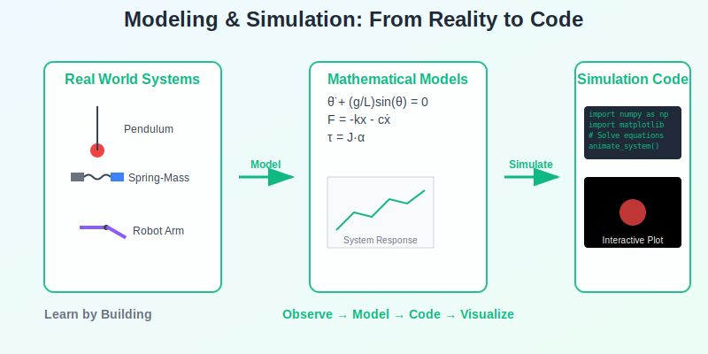

import { Card, CardGrid } from '@astrojs/starlight/components';
import { Tabs, TabItem } from '@astrojs/starlight/components';
import { Steps } from '@astrojs/starlight/components';

Master mathematical modeling and simulation through practical, everyday systems that you can see and understand.

## Learning Path

<Steps>
1. **Model Simple Systems**
   Start with familiar mechanical and physical systems from daily life.

2. **Build Working Simulations**
   Create interactive simulations that demonstrate real behavior.

3. **Solve Practical Problems**
   Apply modeling skills to engineering challenges you might actually encounter.
</Steps>

## Course Structure

<Tabs>
  <TabItem label="Foundations">
    <Steps>
    1. **Simple Physical Systems**
       

       Model and simulate familiar systems like springs, pendulums, and moving objects.
       

    
    2. **Interactive Visualization**
       

       Create visual simulations that show how systems behave over time.
       

    
    3. **Basic Parameter Studies**
       

       Explore how changing inputs affects system behavior and performance.
       

    </Steps>
  </TabItem>
  <TabItem label="Simulation Methods">
    <Steps>
    1. **Python Basics for Modeling**
       

       Essential Python tools for creating and running simple simulations.
       

    
    2. **Animation and Plotting**
       

       Visualize system behavior with moving plots and interactive graphics.
       

    
    3. **Problem-Solving Applications**
       

       Apply modeling to solve specific engineering and design challenges.
       

    </Steps>
  </TabItem>
</Tabs>

## Hands-On Learning

Build working models and simulations of everyday systems. Each tutorial provides complete code and step-by-step implementation.

## Practical Examples

<CardGrid>
  <Card title="Mechanical Motion" icon="setting">
    Springs, pendulums, and moving objects you can visualize and interact with.
  </Card>
  <Card title="Robotics Basics" icon="puzzle">
    Simple arm movements and path planning for robotic systems.
  </Card>
  <Card title="Control Systems" icon="lightning">
    Temperature control, motor speed, and feedback system behavior.
  </Card>
  <Card title="Everyday Physics" icon="star">
    Projectile motion, fluid flow, and heat transfer in familiar contexts.
  </Card>
</CardGrid>

## Tools

Python with NumPy, Matplotlib, and basic scientific libraries.

## Prerequisites

Basic Python and high school physics/math.

Ready to build your first simulation?