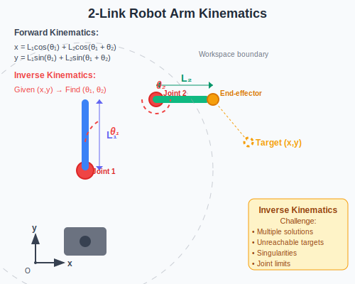

import ModelingSimulationComments from '../../../../components/modeling-and-simulation/ModelingSimulationComments.astro';
import TawkWidget from '../../../../components/TawkWidget.astro';
import UniversalContentContributors from '../../../../components/UniversalContentContributors.astro';
import InArticleAd from '../../../../components/InArticleAd.astro';
import Copyright from '../../../../components/Copyright.astro';
import BionicText from '../../../../components/BionicText.astro';
import TailwindWrapper from '../../../../components/TailwindWrapper.jsx';
import { Tabs, TabItem } from '@astrojs/starlight/components';
import { Card, CardGrid, Badge, Steps, LinkButton } from '@astrojs/starlight/components';

<UniversalContentContributors 
  contributors={frontmatter.contributors}
/>


## Learning Objectives

By the end of this lecture, you should be able to:

1. Understand the inverse kinematics problem in robotics
2. Apply trigonometric methods to solve 2-link arm positioning
3. Appreciate how neural networks can learn motion patterns
4. Compare the advantages and limitations of both approaches
5. Recognize when to use mathematical vs AI solutions

:::tip[Key Concept]
Inverse kinematics asks: "Given a desired position, what joint angles are needed?" This fundamental robotics problem can be solved through precise mathematics or learned through AI.
:::

## The Inverse Kinematics Problem

<InArticleAd />


In robotics, we often need to position the end of a robotic arm (end-effector) at a specific location. This requires determining the joint angles that will achieve the desired position.

<div style={{ display: 'flex', justifyContent: 'center', width: '100%' }}>

</div>

**Forward Kinematics:** Joint angles → End-effector position (easy)
**Inverse Kinematics:** End-effector position → Joint angles (challenging)

<CardGrid>
  <Card title="Why It Matters">
    Essential for pick-and-place operations, painting robots, surgical robots, and any application requiring precise positioning.
  </Card>
  <Card title="The Challenge">
    Multiple solutions may exist, or no solution at all. Some positions are unreachable due to arm length constraints.
  </Card>
  <Card title="Real-World Impact">
    Manufacturing efficiency, surgical precision, and autonomous systems all depend on solving this problem quickly and accurately.
  </Card>
</CardGrid>

## Mathematical Approach: Geometric Solution

<InArticleAd />


The traditional approach uses trigonometry and geometric relationships to calculate exact joint angles.

### Two-Link Arm Analysis

For a 2-link robotic arm with lengths L₁ and L₂:

<Tabs>
  <TabItem label="Geometric Setup">
    Given target position (x, y):
    - Link 1 length: L₁
    - Link 2 length: L₂  
    - Joint 1 angle: θ₁ (shoulder)
    - Joint 2 angle: θ₂ (elbow)
    
    **Constraints:**
    - Target must be within reach: √(x² + y²) ≤ L₁ + L₂
    - Target must be outside minimum reach: √(x² + y²) ≥ |L₁ - L₂|
  </TabItem>
  <TabItem label="Mathematical Solution">
    **Step 1:** Calculate distance to target
    ```
    r = √(x² + y²)
    ```
    
    **Step 2:** Use law of cosines for elbow angle
    ```
    cos(θ₂) = (r² - L₁² - L₂²) / (2 × L₁ × L₂)
    θ₂ = ±arccos(cos(θ₂))
    ```
    
    **Step 3:** Calculate shoulder angle
    ```
    α = atan2(y, x)
    β = atan2(L₂ × sin(θ₂), L₁ + L₂ × cos(θ₂))
    θ₁ = α - β
    ```
  </TabItem>
  <TabItem label="Implementation">
    ```python
    import numpy as np
    
    def inverse_kinematics_2link(x, y, L1, L2):
        # Check if target is reachable
        r = np.sqrt(x*x + y*y)
        if r > L1 + L2 or r < abs(L1 - L2):
            return None, None  # Unreachable
        
        # Calculate elbow angle (two solutions)
        cos_theta2 = (r*r - L1*L1 - L2*L2) / (2*L1*L2)
        theta2_1 = np.arccos(cos_theta2)   # Elbow up
        theta2_2 = -np.arccos(cos_theta2)  # Elbow down
        
        # Calculate shoulder angles
        alpha = np.arctan2(y, x)
        beta1 = np.arctan2(L2*np.sin(theta2_1), L1 + L2*np.cos(theta2_1))
        beta2 = np.arctan2(L2*np.sin(theta2_2), L1 + L2*np.cos(theta2_2))
        
        theta1_1 = alpha - beta1
        theta1_2 = alpha - beta2
        
        return (theta1_1, theta2_1), (theta1_2, theta2_2)
    ```
  </TabItem>
</Tabs>

### Interactive Mathematical Demo

<div style={{ width: '100%', height: '1200px', marginBottom: '2rem' }}>
  <iframe 
    src="/education/modeling-and-simulation/components/math-inverse-kinematics.html" 
    style={{ width: '100%', height: '100%', border: 'none', borderRadius: '8px' }}
    title="Math Approach to Inverse Kinematics" 
  />
</div>

**Try this:** Manually set different target positions and observe how the mathematical solution instantly calculates the exact joint angles needed. Notice the two possible configurations (elbow up/down) for most positions.

## AI Approach: Neural Network Learning

<InArticleAd />


Instead of deriving equations, we can train a neural network to learn the relationship between positions and joint angles from data.

### Neural Network Architecture

<Tabs>
  <TabItem label="Network Design">
    **Input Layer:** Target position (x, y)
    **Hidden Layers:** 2-3 layers with 16-32 neurons each
    **Output Layer:** Joint angles (θ₁, θ₂)
    **Activation:** ReLU for hidden layers, linear for output
    
    ```python
    import tensorflow as tf
    
    model = tf.keras.Sequential([
        tf.keras.layers.Dense(32, activation='relu', input_shape=(2,)),
        tf.keras.layers.Dense(32, activation='relu'),
        tf.keras.layers.Dense(16, activation='relu'),
        tf.keras.layers.Dense(2, activation='linear')  # θ₁, θ₂
    ])
    ```
  </TabItem>
  <TabItem label="Training Data">
    **Data Generation:**
    1. Generate random joint angles
    2. Calculate resulting end-effector positions (forward kinematics)
    3. Create (position → angles) training pairs
    
    ```python
    def generate_training_data(n_samples=10000):
        theta1 = np.random.uniform(-np.pi, np.pi, n_samples)
        theta2 = np.random.uniform(-np.pi, np.pi, n_samples)
        
        # Forward kinematics
        x = L1 * np.cos(theta1) + L2 * np.cos(theta1 + theta2)
        y = L1 * np.sin(theta1) + L2 * np.sin(theta1 + theta2)
        
        positions = np.column_stack([x, y])
        angles = np.column_stack([theta1, theta2])
        
        return positions, angles
    ```
  </TabItem>
  <TabItem label="Training Process">
    **Loss Function:** Mean squared error between predicted and actual angles
    **Optimization:** Adam optimizer with learning rate scheduling
    **Regularization:** Dropout and early stopping to prevent overfitting
    
    ```python
    model.compile(
        optimizer='adam',
        loss='mse',
        metrics=['mae']
    )
    
    history = model.fit(
        train_positions, train_angles,
        validation_data=(val_positions, val_angles),
        epochs=100,
        batch_size=32,
        callbacks=[
            tf.keras.callbacks.EarlyStopping(patience=10),
            tf.keras.callbacks.ReduceLROnPlateau(patience=5)
        ]
    )
    ```
  </TabItem>
</Tabs>

### Interactive AI Demo

<div style={{ width: '100%', height: '1200px', marginBottom: '2rem' }}>
  <iframe 
    src="/education/modeling-and-simulation/components/ai-inverse-kinematics.html" 
    style={{ width: '100%', height: '100%', border: 'none', borderRadius: '8px' }}
    title="AI Approach to Inverse Kinematics" 
  />
</div>

**Try this:** Manually set target positions and see how the neural network predicts joint angles. Notice how it learns smooth motion patterns and handles the workspace boundaries. The prediction may not be as precise as the mathematical solution but shows learned behavior.

## Comparing Both Approaches

<InArticleAd />


<CardGrid>
  <Card title="Mathematical Approach" icon="document">
    **Advantages:**
    - Exact solutions when they exist
    - Instant computation
    - Predictable and interpretable
    - No training data required
    
    **Disadvantages:**
    - Complex for >2 joints
    - Doesn't handle constraints well
    - Multiple solutions require selection logic
    - Difficult for non-standard geometries
  </Card>
  <Card title="AI Approach" icon="star">
    **Advantages:**
    - Handles complex geometries
    - Can incorporate constraints naturally
    - Scales to many joints
    - Learns from demonstrations
    
    **Disadvantages:**
    - Requires training data
    - Approximate solutions
    - Black box behavior
    - Training time and computational overhead
  </Card>
</CardGrid>

### Performance Comparison

| Aspect | Mathematical | AI/Neural Network |
|--------|-------------|-------------------|
| **Accuracy** | Exact (when solvable) | Approximate (~1-5% error) |
| **Speed** | Microseconds | Milliseconds |
| **Complexity** | Exponential with joints | Linear with network size |
| **Flexibility** | Rigid, geometry-specific | Adaptable to any configuration |
| **Interpretability** | Fully interpretable | Black box |
| **Training** | None required | Hours to days |

## Real-World Applications

<InArticleAd />


### When to Use Mathematical Approaches

- **Precision manufacturing:** CNC machines, 3D printers
- **Simple robots:** 2-3 DOF arms where exact solutions exist
- **Real-time control:** High-frequency control loops
- **Safety-critical systems:** Medical robots, automotive systems

### When to Use AI Approaches

- **Complex robots:** 6+ DOF industrial arms
- **Obstacle avoidance:** Path planning with environmental constraints
- **Human-robot interaction:** Learning from demonstration
- **Non-standard geometries:** Soft robots, cable-driven systems

## Practical Example: Pick and Place Robot

<InArticleAd />


<Card title="Industrial Application" icon="open-book">

A pick-and-place robot needs to move objects from position A(0.3, 0.2) to position B(0.5, 0.4) meters. The robot has two links: L₁ = 0.3m, L₂ = 0.25m.

Calculate the joint angles for both positions using the mathematical approach.

</Card>

<details>
<summary>Solution</summary>

**Position A (0.3, 0.2):**

Distance: r = √(0.3² + 0.2²) = √(0.09 + 0.04) = 0.36m

Check reachability: 0.05m ≤ 0.36m ≤ 0.55m ✓

Elbow angle:
cos(θ₂) = (0.36² - 0.3² - 0.25²) / (2 × 0.3 × 0.25) = -0.277
θ₂ = ±arccos(-0.277) = ±106.1°

For elbow up (θ₂ = 106.1°):
α = arctan2(0.2, 0.3) = 33.7°
β = arctan2(0.25×sin(106.1°), 0.3 + 0.25×cos(106.1°)) = 82.4°
θ₁ = 33.7° - 82.4° = -48.7°

**Position B (0.5, 0.4):**

Distance: r = √(0.5² + 0.4²) = √(0.25 + 0.16) = 0.64m

This exceeds maximum reach (0.55m), so position B is unreachable!

**Solution:** Robot needs to be repositioned or a longer arm is required.
</details>

## Assignment: Hybrid Approach

<InArticleAd />


<Card title="Advanced Challenge" icon="pencil">

Implement a hybrid system that:

1. Uses mathematical IK when exact solutions exist
2. Falls back to neural network for complex constraints
3. Compare accuracy and speed for 100 random target positions
4. Identify scenarios where each approach excels

**Bonus:** Add obstacle avoidance to the AI approach by including obstacle positions in the input data during training.

</Card>

## Key Takeaways

<InArticleAd />


- **Mathematical IK** provides exact, fast solutions for simple geometries
- **AI approaches** excel with complex robots and learned behaviors  
- **Hybrid systems** can combine the best of both approaches
- **Problem complexity** determines which method is most appropriate
- **Real-world robotics** often requires both approaches for different situations

The future of robotics lies in intelligently combining precise mathematical foundations with adaptive AI capabilities.

## Next Steps

<InArticleAd />


With these fundamentals, you can explore:
- **Multi-DOF robots:** 6+ joint industrial manipulators
- **Redundancy resolution:** Choosing optimal solutions when multiple exist
- **Real-time planning:** Motion planning with dynamic obstacles
- **Learning from demonstration:** Teaching robots through human examples


<InArticleAd />
<ModelingSimulationComments />
<TawkWidget />
<Copyright />