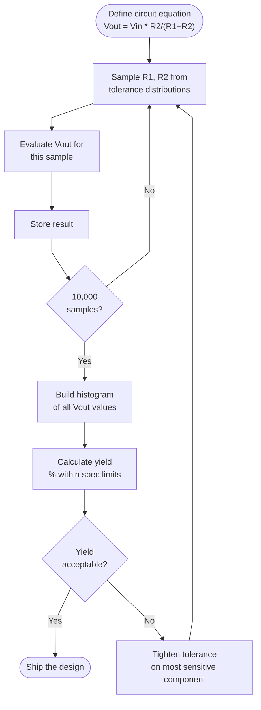

import ModelingSimulationComments from '../../../../components/modeling-and-simulation/ModelingSimulationComments.astro';
import TawkWidget from '../../../../components/TawkWidget.astro';
import UniversalContentContributors from '../../../../components/UniversalContentContributors.astro';
import InArticleAd from '../../../../components/InArticleAd.astro';
import Copyright from '../../../../components/Copyright.astro';
import BionicText from '../../../../components/BionicText.astro';
import TailwindWrapper from '../../../../components/TailwindWrapper.jsx';
import { Tabs, TabItem } from '@astrojs/starlight/components';
import { Card, CardGrid, Badge, Steps, LinkButton, FileTree } from '@astrojs/starlight/components';

<UniversalContentContributors 
  contributors={frontmatter.contributors}
/>


You designed a voltage divider on paper. The math says the output should be 3.3 V. You build ten boards, and the outputs range from 3.1 V to 3.5 V. None of them hit 3.3 V exactly. Every resistor has a tolerance, every capacitor drifts with temperature, every PCB trace has manufacturing variation. Worst-case analysis tells you the extreme bounds, but it is overly pessimistic because it assumes every component is simultaneously at its worst. Monte Carlo simulation gives you the real answer: run the circuit equation 10,000 times, each time drawing component values from their tolerance distributions, and build a histogram of outcomes. Now you can make quantitative decisions: which components need tighter tolerances, and which are already good enough. #MonteCarlo #ToleranceAnalysis #EngineeringDesign

## The Monte Carlo Idea

<Card title="Why Monte Carlo Works" icon="star">
Monte Carlo simulation replaces an intractable analytical calculation with repeated random sampling. Instead of solving for the exact probability distribution of the output (which may require integrating over dozens of correlated variables), you sample each input variable from its known distribution, evaluate the system equation, and collect the results. For the probability and statistics foundations behind these distributions, see [Applied Mathematics: Probability, Statistics, and Noise](/education/applied-mathematics/probability-statistics-noise/). With enough samples, the histogram of outputs converges to the true distribution. The name comes from the Monte Carlo casino: the method was invented by physicists working on nuclear weapons at Los Alamos who noticed that random sampling could solve problems that defied closed-form solutions.
</Card>



### When to Use Monte Carlo

Monte Carlo is the right tool when:

- The system equation involves nonlinear combinations of random variables
- There are too many random variables for analytical integration
- You need the full output distribution, not just mean and variance
- You want to answer questions like "what percentage of units will pass?"

It is not needed when:

- The system is a linear combination of Gaussian variables (the output is also Gaussian; just propagate mean and variance analytically)
- You only need worst-case bounds (use min/max analysis instead)

## Project: Tolerance Stackup Analyzer

<InArticleAd />


<Card title="What You Will Build" icon="rocket">
A Monte Carlo tolerance analyzer that models a voltage divider circuit with real component tolerances. It runs 10,000 trials for each tolerance grade (1%, 2%, 5%, 10%), plots histograms of the output voltage, computes yield (percentage within specification), and determines the minimum tolerance grade needed to achieve a target yield. A second example analyzes a mechanical shaft-bearing-housing assembly.
</Card>

### Complete Runnable Code

```python
import numpy as np
import matplotlib.pyplot as plt

# ============================================================
# Monte Carlo Tolerance Stackup Analyzer
# ============================================================
# Analyzes how component tolerances affect system performance
# and predicts manufacturing yield.

np.random.seed(42)

N_TRIALS = 50000  # Number of Monte Carlo trials

# ============================================================
# Example 1: Voltage Divider Tolerance Analysis
# ============================================================
# Circuit: Vin ---[R1]---+---[R2]--- GND
#                        |
#                       Vout
#
# Vout = Vin * R2 / (R1 + R2)
#
# Nominal design: Vin = 5.0V, R1 = 10k, R2 = 20k
# Target Vout = 5.0 * 20k / (10k + 20k) = 3.333 V
# Specification: 3.3 V +/- 0.1 V (3.2 to 3.4 V)

Vin_nominal = 5.0
R1_nominal = 10e3   # 10 kohm
R2_nominal = 20e3   # 20 kohm

Vout_target = Vin_nominal * R2_nominal / (R1_nominal + R2_nominal)
Vout_spec_low = 3.2
Vout_spec_high = 3.4

print("=" * 65)
print("  Monte Carlo Tolerance Stackup Analysis")
print("=" * 65)
print(f"  Voltage divider: Vin={Vin_nominal}V, R1={R1_nominal/1e3:.0f}k, R2={R2_nominal/1e3:.0f}k")
print(f"  Nominal Vout:    {Vout_target:.4f} V")
print(f"  Specification:   {Vout_spec_low:.1f} V to {Vout_spec_high:.1f} V")
print(f"  Trials:          {N_TRIALS:,}")
print("-" * 65)

def voltage_divider_mc(R1_nom, R2_nom, Vin, tolerance_pct, n_trials):
    """
    Run Monte Carlo simulation for a voltage divider.
    Components are assumed to have uniform distribution within tolerance.
    (Uniform is conservative; real resistors often follow truncated Gaussian.)
    """
    tol = tolerance_pct / 100.0

    # Sample R1 and R2 from uniform distribution within tolerance
    R1_samples = R1_nom * (1 + tol * (2 * np.random.rand(n_trials) - 1))
    R2_samples = R2_nom * (1 + tol * (2 * np.random.rand(n_trials) - 1))

    # Compute Vout for each trial
    Vout_samples = Vin * R2_samples / (R1_samples + R2_samples)

    return Vout_samples

# Run for different tolerance grades
tolerances = [1, 2, 5, 10]
results = {}

for tol in tolerances:
    vout = voltage_divider_mc(R1_nominal, R2_nominal, Vin_nominal, tol, N_TRIALS)

    in_spec = np.sum((vout >= Vout_spec_low) & (vout <= Vout_spec_high))
    yield_pct = 100.0 * in_spec / N_TRIALS

    results[tol] = {
        'vout': vout,
        'mean': np.mean(vout),
        'std': np.std(vout),
        'min': np.min(vout),
        'max': np.max(vout),
        'yield': yield_pct,
    }

    print(f"  {tol:2d}% tolerance: mean={np.mean(vout):.4f}V, "
          f"std={np.std(vout):.4f}V, "
          f"range=[{np.min(vout):.3f}, {np.max(vout):.3f}]V, "
          f"yield={yield_pct:.1f}%")

# ============================================================
# Example 2: Mechanical Tolerance Stackup
# ============================================================
# Assembly: shaft inserted into bearing, bearing pressed into housing
#
#   |<-- Housing bore -->|
#   |  |<-- Bearing OD ->|  |
#   |  |  |<- Bearing ID ->|  |
#   |  |  |  |<- Shaft OD ->|  |
#
# Clearance = Bearing_ID - Shaft_OD
# Interference = Bearing_OD - Housing_bore (press fit)
#
# We need: clearance > 0.01 mm (shaft must spin freely)
#          interference > 0.005 mm (bearing must not fall out)

print("\n" + "=" * 65)
print("  Mechanical Tolerance Stackup: Shaft + Bearing + Housing")
print("=" * 65)

# Nominal dimensions (mm)
shaft_od_nom = 25.000
bearing_id_nom = 25.030   # 30 um nominal clearance
bearing_od_nom = 47.000
housing_bore_nom = 46.985  # 15 um nominal interference

# Manufacturing tolerances (mm), assumed Gaussian (3-sigma = tolerance)
shaft_tol = 0.010      # +/- 10 um
bearing_id_tol = 0.008  # +/- 8 um
bearing_od_tol = 0.008  # +/- 8 um
housing_tol = 0.012     # +/- 12 um

# Sample dimensions (Gaussian, 3-sigma = tolerance)
shaft_od = np.random.normal(shaft_od_nom, shaft_tol / 3, N_TRIALS)
bearing_id = np.random.normal(bearing_id_nom, bearing_id_tol / 3, N_TRIALS)
bearing_od = np.random.normal(bearing_od_nom, bearing_od_tol / 3, N_TRIALS)
housing_bore = np.random.normal(housing_bore_nom, housing_tol / 3, N_TRIALS)

# Compute clearance and interference
clearance = bearing_id - shaft_od       # must be > 0.01 mm
interference = bearing_od - housing_bore  # must be > 0.005 mm

clearance_ok = clearance > 0.01
interference_ok = interference > 0.005
both_ok = clearance_ok & interference_ok

mech_yield = 100.0 * np.sum(both_ok) / N_TRIALS

print(f"  Shaft OD:       {shaft_od_nom:.3f} +/- {shaft_tol:.3f} mm")
print(f"  Bearing ID:     {bearing_id_nom:.3f} +/- {bearing_id_tol:.3f} mm")
print(f"  Bearing OD:     {bearing_od_nom:.3f} +/- {bearing_od_tol:.3f} mm")
print(f"  Housing bore:   {housing_bore_nom:.3f} +/- {housing_tol:.3f} mm")
print(f"  ---")
print(f"  Clearance:      mean={np.mean(clearance):.4f} mm, "
      f"std={np.std(clearance):.4f} mm")
print(f"  Interference:   mean={np.mean(interference):.4f} mm, "
      f"std={np.std(interference):.4f} mm")
print(f"  Clearance OK:   {100*np.mean(clearance_ok):.1f}%")
print(f"  Interference OK:{100*np.mean(interference_ok):.1f}%")
print(f"  Both OK (yield):{mech_yield:.1f}%")
print("=" * 65)

# ============================================================
# Sensitivity analysis: which component matters most?
# ============================================================
print("\n--- Sensitivity Analysis (Voltage Divider, 5% tolerance) ---")

# Baseline
baseline_std = results[5]['std']

# Tighten R1 only to 1%
vout_tight_r1 = voltage_divider_mc(R1_nominal, R2_nominal, Vin_nominal, 1, N_TRIALS)
# Keep R1 at 5%, measured as if R2 is tight
R1_5pct = R1_nominal * (1 + 0.05 * (2 * np.random.rand(N_TRIALS) - 1))
R2_1pct = R2_nominal * (1 + 0.01 * (2 * np.random.rand(N_TRIALS) - 1))
vout_tight_r2 = Vin_nominal * R2_1pct / (R1_5pct + R2_1pct)

# Tighten R2 only to 1%
R1_5pct2 = R1_nominal * (1 + 0.05 * (2 * np.random.rand(N_TRIALS) - 1))
R2_1pct2 = R2_nominal * (1 + 0.01 * (2 * np.random.rand(N_TRIALS) - 1))
vout_tight_r2_only = Vin_nominal * R2_1pct2 / (R1_5pct2 + R2_1pct2)

print(f"  Both at 5%:     std = {baseline_std:.5f} V")
print(f"  Both at 1%:     std = {np.std(vout_tight_r1):.5f} V")
print(f"  R1=5%, R2=1%:   std = {np.std(vout_tight_r2):.5f} V")
print(f"  R1=5%, R2=1%:   std = {np.std(vout_tight_r2_only):.5f} V")
print(f"  -> Tightening R2 alone reduces variation because R2 is larger")
print(f"     and contributes more to the output voltage sensitivity.")

# ============================================================
# Plot results
# ============================================================
fig, axes = plt.subplots(2, 2, figsize=(14, 10))

# Plot 1: Voltage divider histograms for each tolerance
ax = axes[0, 0]
colors = ['green', 'blue', 'orange', 'red']
for tol, color in zip(tolerances, colors):
    r = results[tol]
    ax.hist(r['vout'], bins=80, alpha=0.5, color=color, density=True,
            label=f'{tol}% tol (yield={r["yield"]:.1f}%)')
ax.axvline(Vout_spec_low, color='black', linestyle='--', linewidth=2, label='Spec limits')
ax.axvline(Vout_spec_high, color='black', linestyle='--', linewidth=2)
ax.axvline(Vout_target, color='black', linestyle='-', linewidth=1, alpha=0.5)
ax.set_xlabel('Output Voltage (V)')
ax.set_ylabel('Probability Density')
ax.set_title('Voltage Divider: Output Distribution by Tolerance Grade')
ax.legend(fontsize=8)
ax.grid(True, alpha=0.3)

# Plot 2: Yield vs tolerance
ax = axes[0, 1]
yields = [results[t]['yield'] for t in tolerances]
ax.bar([str(t) + '%' for t in tolerances], yields, color=colors, alpha=0.7,
       edgecolor='black')
ax.axhline(y=99.0, color='green', linestyle='--', alpha=0.7, label='99% target')
ax.axhline(y=95.0, color='orange', linestyle='--', alpha=0.7, label='95% target')
ax.set_xlabel('Component Tolerance')
ax.set_ylabel('Yield (%)')
ax.set_title('Manufacturing Yield vs Component Tolerance')
ax.legend()
ax.grid(True, alpha=0.3, axis='y')
for i, (tol, y) in enumerate(zip(tolerances, yields)):
    ax.text(i, y + 0.5, f'{y:.1f}%', ha='center', fontsize=10, fontweight='bold')

# Plot 3: Mechanical clearance histogram
ax = axes[1, 0]
ax.hist(clearance * 1000, bins=80, alpha=0.6, color='steelblue', density=True,
        label=f'Clearance (yield={100*np.mean(clearance_ok):.1f}%)')
ax.axvline(10, color='red', linestyle='--', linewidth=2, label='Min clearance (10 um)')
ax.axvline(0, color='black', linestyle='-', linewidth=1, alpha=0.5)
ax.set_xlabel('Clearance (um)')
ax.set_ylabel('Probability Density')
ax.set_title('Shaft-Bearing Clearance Distribution')
ax.legend(fontsize=9)
ax.grid(True, alpha=0.3)

# Plot 4: Mechanical interference histogram
ax = axes[1, 1]
ax.hist(interference * 1000, bins=80, alpha=0.6, color='coral', density=True,
        label=f'Interference (yield={100*np.mean(interference_ok):.1f}%)')
ax.axvline(5, color='red', linestyle='--', linewidth=2, label='Min interference (5 um)')
ax.axvline(0, color='black', linestyle='-', linewidth=1, alpha=0.5)
ax.set_xlabel('Interference (um)')
ax.set_ylabel('Probability Density')
ax.set_title('Bearing-Housing Interference Distribution')
ax.legend(fontsize=9)
ax.grid(True, alpha=0.3)

plt.tight_layout()
plt.savefig('monte_carlo_tolerance.png', dpi=150, bbox_inches='tight')
plt.show()
print("\nPlot saved: monte_carlo_tolerance.png")
```

### Reading the Results

<Steps>

1. **Histogram spread.** The histograms show how component tolerance propagates to the output. With 1% resistors, the output voltage distribution is a narrow spike centered on the target. With 10% resistors, the distribution is wide and a significant fraction of boards fall outside specification.

2. **Yield numbers.** The yield percentage tells you what fraction of manufactured boards (or assemblies) will meet the specification. This is the number that matters for production planning. If your yield is 92%, you need to build 109 units to ship 100.

3. **Sensitivity analysis.** By tightening one component at a time, you discover which component contributes most to output variation. In a voltage divider, the larger resistor (R2) has more influence because it appears in both numerator and denominator. Spending money on tighter R2 tolerance gives more improvement than tightening R1.

4. **Mechanical stackup.** The shaft-bearing-housing example shows that clearance and interference are both random variables. Even when nominal dimensions look fine, manufacturing variation can produce assemblies where the shaft binds (clearance too small) or the bearing falls out (interference too small).

</Steps>

## Monte Carlo vs Worst-Case Analysis

<InArticleAd />


Worst-case analysis assumes every component is simultaneously at its worst tolerance limit. For the voltage divider with 5% resistors:

- Worst-case high: R1 at -5%, R2 at +5%, giving maximum Vout
- Worst-case low: R1 at +5%, R2 at -5%, giving minimum Vout

This gives a wide range, but the probability of every component being at its extreme simultaneously is negligible. Monte Carlo shows the realistic distribution.

| Method | Output range (5% resistors) | Useful for |
|--------|----------------------------|------------|
| Worst-case | Widest possible range | Safety-critical bounds |
| RSS (root sum square) | Moderate range | Quick estimate if linear and Gaussian |
| Monte Carlo | Realistic distribution | Full picture, nonlinear systems, yield |

For safety-critical applications (medical devices, aerospace), you often need worst-case analysis for certification plus Monte Carlo for design optimization.

## Choosing Distributions

<InArticleAd />


Real component values do not follow a single universal distribution. The choice of distribution matters:

| Component | Typical Distribution | Notes |
|-----------|---------------------|-------|
| Resistors (tight tolerance) | Truncated Gaussian | Factory-tested, rejects removed |
| Resistors (wide tolerance) | Uniform | Leftover after tight-tolerance parts are sold |
| Capacitors | Truncated Gaussian | Temperature and aging add systematic shift |
| Machined dimensions | Gaussian | Central limit theorem applies to machining errors |
| PCB trace width | Gaussian | Etching process variation is symmetric |

The uniform distribution is conservative (worst-case compatible with Monte Carlo). If you have actual manufacturing data, fit the observed distribution and use that.

## Number of Trials

<InArticleAd />


How many trials do you need? The standard error of a Monte Carlo estimate decreases as $1/\sqrt{N}$:

| Trials | Standard error of mean | Standard error of 99th percentile |
|--------|----------------------|-----------------------------------|
| 1,000 | Moderate | Poor |
| 10,000 | Good for means | Acceptable |
| 100,000 | Excellent | Good |
| 1,000,000 | Overkill for means | Excellent for tail estimates |

For yield estimation, you need more trials when the yield is close to 100%. To estimate 99.9% yield with confidence, you need at least 100,000 trials so that you have enough failures (about 100) to estimate the failure rate reliably.

## Exercises

<InArticleAd />


1. **Temperature drift.** Add a temperature coefficient to the resistors: each resistor drifts by $\pm$100 ppm per degree C. Run the Monte Carlo with temperature uniformly distributed from 0 to 70 degrees C. How does yield change?

2. **Voltage regulator.** Model a linear voltage regulator with input voltage (5.0V, 5% tolerance), reference voltage (1.25V, 1% tolerance), and two feedback resistors (both 1% tolerance). The output is $V_{out} = V_{ref} \cdot (1 + R_1/R_2)$. What yield do you get for 3.3V +/- 2%?

3. **Mechanical press fit.** In the shaft-bearing example, tighten the housing bore tolerance from 12 um to 6 um. How much does yield improve? What if you tighten the shaft instead?

4. **Correlated variations.** What if R1 and R2 come from the same reel and their errors are correlated (both tend to be high or both tend to be low)? Modify the simulation to use correlated random samples and observe how the output distribution changes.

5. **Cost optimization.** Assign costs to each tolerance grade (1% costs 3x more than 5%). Find the combination of R1 and R2 tolerances that achieves 99% yield at minimum total cost.

## References

<InArticleAd />


- Gilks, W. R. et al. (1995). *Markov Chain Monte Carlo in Practice*. Chapman and Hall. The statistical foundations.
- Bruns, M. (2006). *Tolerance Analysis and Optimization of Mechanical Assemblies*. PhD Thesis, University of Erlangen. Good coverage of mechanical tolerance stackup methods.
- Hayter, A. J. (2012). *Probability and Statistics for Engineers and Scientists*. Cengage. Covers the statistical fundamentals behind Monte Carlo.
- Analog Devices Application Note AN-1208. *Component Tolerances and their Effect on Filter Performance*. Practical tolerance analysis for analog circuits.


<InArticleAd />
<ModelingSimulationComments />
<TawkWidget />
<Copyright />