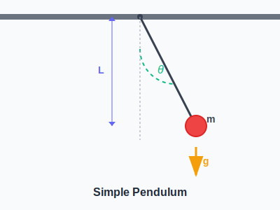

import ModelingSimulationComments from '../../../../components/modeling-and-simulation/ModelingSimulationComments.astro';
import TawkWidget from '../../../../components/TawkWidget.astro';
import UniversalContentContributors from '../../../../components/UniversalContentContributors.astro';
import InArticleAd from '../../../../components/InArticleAd.astro';
import Copyright from '../../../../components/Copyright.astro';
import BionicText from '../../../../components/BionicText.astro';
import TailwindWrapper from '../../../../components/TailwindWrapper.jsx';
import { Tabs, TabItem } from '@astrojs/starlight/components';
import { Card, CardGrid, Badge, Steps, LinkButton } from '@astrojs/starlight/components';

<UniversalContentContributors 
  contributors={frontmatter.contributors}
/>

import PendulumDemo from './components/demos/PendulumDemo';

## Learning Objectives

By the end of this lecture, you should be able to:

1. Set up the mathematical model for a simple pendulum
2. Understand the small angle approximation and when to use it
3. Implement the pendulum equation using numerical methods
4. Create an animated visualization of pendulum motion
5. Explore how different parameters affect pendulum behavior

:::tip[Key Concept]
A pendulum is one of the simplest systems that demonstrates oscillatory motion, making it perfect for learning modeling fundamentals.
:::

## The Physical System


<InArticleAd />

A simple pendulum consists of a mass (bob) attached to a string of length L, swinging under the influence of gravity.

<div style={{ display: 'flex', justifyContent: 'center', width: '100%' }}>

</div>

**Key Variables:**
- θ (theta): Angular displacement from vertical
- L: Length of the pendulum
- m: Mass of the bob
- g: Gravitational acceleration (9.81 m/s²)

## Mathematical Model


<InArticleAd />

The motion of a pendulum is governed by the equation:

:::tip[Pendulum Equation]
$$\frac{d^2\theta}{dt^2} + \frac{g}{L}\sin(\theta) = 0$$
:::

For small angles (θ < 15°), we can use the approximation sin(θ) ≈ θ:

:::tip[Small Angle Approximation]
$$\frac{d^2\theta}{dt^2} + \frac{g}{L}\theta = 0$$
:::

This gives us simple harmonic motion with period:
$$T = 2\pi\sqrt{\frac{L}{g}}$$

## Building the Simulation


<InArticleAd />

Let's implement the pendulum model step by step:

<Tabs>
  <TabItem label="Setup & Imports">
```python
import numpy as np
import matplotlib.pyplot as plt
from matplotlib.animation import FuncAnimation

# Physical parameters
L = 1.0      # Length (m)
g = 9.81     # Gravity (m/s²)
theta0 = 0.3 # Initial angle (radians)
omega0 = 0.0 # Initial angular velocity

# Time parameters
dt = 0.01    # Time step
t_max = 10   # Total time
time = np.arange(0, t_max, dt)
```
  </TabItem>
  <TabItem label="Numerical Solution">
```python
def pendulum_ode(theta, omega, t):
    """Pendulum equations of motion"""
    dtheta_dt = omega
    domega_dt = -(g/L) * np.sin(theta)
    return dtheta_dt, domega_dt

# Solve using Euler method
theta = np.zeros(len(time))
omega = np.zeros(len(time))

theta[0] = theta0
omega[0] = omega0

for i in range(len(time)-1):
    dtheta, domega = pendulum_ode(theta[i], omega[i], time[i])
    theta[i+1] = theta[i] + dtheta * dt
    omega[i+1] = omega[i] + domega * dt
```
  </TabItem>
  <TabItem label="Animation">
```python
# Create animation
fig, ax = plt.subplots()
ax.set_xlim(-1.5, 1.5)
ax.set_ylim(-1.5, 1.5)
ax.set_aspect('equal')

line, = ax.plot([], [], 'o-', lw=2, markersize=8)
time_text = ax.text(0.02, 0.95, '', transform=ax.transAxes)

def animate(frame):
    # Calculate position
    x = L * np.sin(theta[frame])
    y = -L * np.cos(theta[frame])
    
    # Update pendulum
    line.set_data([0, x], [0, y])
    time_text.set_text(f'Time = {time[frame]:.1f}s')
    return line, time_text

ani = FuncAnimation(fig, animate, frames=len(time), 
                   interval=50, blit=True)
plt.show()
```
  </TabItem>
</Tabs>

<div style={{ display: 'flex', justifyContent: 'center', width: '100%' }}>
  <TailwindWrapper>
    <PendulumDemo client:load />
  </TailwindWrapper>

</div>

## Parameter Studies


<InArticleAd />

Explore how different parameters affect pendulum behavior:

<CardGrid>
  <Card title="Length Effect">
    Longer pendulums have longer periods. Try L = 0.5m vs L = 2.0m to see the difference.
  </Card>
  <Card title="Initial Angle">
    Large angles break the small angle approximation. Compare θ₀ = 0.1 rad vs θ₀ = 1.0 rad.
  </Card>
  <Card title="Damping">
    Add air resistance: `domega_dt = -(g/L) * np.sin(theta) - b * omega`
  </Card>
</CardGrid>

## Example Problem


<InArticleAd />

<Card title="Clock Pendulum Design" icon="open-book">

Design a pendulum clock that ticks every second (period T = 2s). What length should the pendulum be?

</Card>

<details>
<summary>Solution</summary>

Using the period formula for small oscillations:
$$T = 2\pi\sqrt{\frac{L}{g}}$$

Solve for L:
$$L = \frac{gT^2}{4\pi^2}$$

Substituting values:
$$L = \frac{9.81 \times 2^2}{4\pi^2} = \frac{9.81 \times 4}{39.48} = 0.994 \text{ m}$$

Therefore, the pendulum should be approximately 1 meter long.
</details>

## Assignment


<InArticleAd />

<Card title="Pendulum Experiment" icon="pencil">

1. Modify the code to include air resistance (damping)
2. Compare the motion with and without damping
3. Find the damping coefficient that reduces the amplitude by half in 10 swings
4. Create plots showing energy conservation (or loss with damping)

</Card>

## Key Takeaways


<InArticleAd />

- Mathematical modeling translates physical principles into equations
- Numerical methods solve equations that lack analytical solutions
- Visualization helps understand system behavior
- Parameter studies reveal how design choices affect performance

## Next Lecture


<InArticleAd />

In the next lecture, we'll explore spring-mass systems and learn about resonance, natural frequencies, and how these concepts apply to vibration control in engineering systems.

<InArticleAd />
<ModelingSimulationComments />
<TawkWidget />
<Copyright />