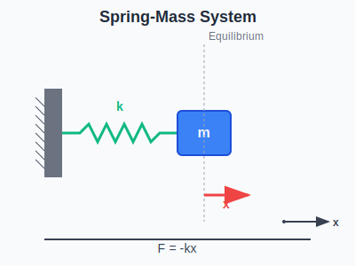

import ModelingSimulationComments from '../../../../components/modeling-and-simulation/ModelingSimulationComments.astro';
import TawkWidget from '../../../../components/TawkWidget.astro';
import UniversalContentContributors from '../../../../components/UniversalContentContributors.astro';
import InArticleAd from '../../../../components/InArticleAd.astro';
import Copyright from '../../../../components/Copyright.astro';
import BionicText from '../../../../components/BionicText.astro';
import TailwindWrapper from '../../../../components/TailwindWrapper.jsx';
import { Tabs, TabItem } from '@astrojs/starlight/components';
import { Card, CardGrid, Badge, Steps, LinkButton } from '@astrojs/starlight/components';

<UniversalContentContributors 
  contributors={frontmatter.contributors}
/>


import SpringMassDemo from './components/demos/SpringMassDemo';

## Learning Objectives

By the end of this lecture, you should be able to:

1. Model spring-mass systems with and without damping
2. Calculate natural frequency and understand resonance
3. Simulate forced vibrations and frequency response
4. Analyze the effects of damping on system behavior
5. Apply these concepts to real engineering problems

:::tip[Key Concept]
Spring-mass systems are fundamental building blocks for understanding vibrations in everything from car suspensions to building earthquake protection.

:::

## The Physical System

<InArticleAd />


A spring-mass system consists of a mass m connected to a spring with stiffness k, often with some damping c.

<div style={{ display: 'flex', justifyContent: 'center', width: '100%' }}>

</div>

**Key Variables:**
- x: Displacement from equilibrium
- m: Mass (kg)
- k: Spring constant (N/m)
- c: Damping coefficient (N⋅s/m)
- F(t): External forcing function

## Mathematical Models

<InArticleAd />


<Tabs>
  <TabItem label="Free Vibration">
    **Undamped System:**
    $$m\frac{d^2x}{dt^2} + kx = 0$$
    
    **Natural frequency:**
    $$\omega_n = \sqrt{\frac{k}{m}}$$
    
    **Period:**
    $$T = \frac{2\pi}{\omega_n}$$
  </TabItem>
  <TabItem label="Damped System">
    **With Damping:**
    $$m\frac{d^2x}{dt^2} + c\frac{dx}{dt} + kx = 0$$
    
    **Damping ratio:**
    $$\zeta = \frac{c}{2\sqrt{km}}$$
    
    **Damped frequency:**
    $$\omega_d = \omega_n\sqrt{1-\zeta^2}$$
  </TabItem>
  <TabItem label="Forced Vibration">
    **With External Force:**
    $$m\frac{d^2x}{dt^2} + c\frac{dx}{dt} + kx = F_0\cos(\omega t)$$
    
    **Amplitude at steady state:**
    $$X = \frac{F_0/k}{\sqrt{(1-r^2)^2 + (2\zeta r)^2}}$$
    
    where $r = \omega/\omega_n$
  </TabItem>
</Tabs>

## Building the Simulation

<InArticleAd />


<Tabs>
  <TabItem label="Basic Setup">
```python
import numpy as np
import matplotlib.pyplot as plt
from matplotlib.animation import FuncAnimation

# System parameters
m = 1.0      # Mass (kg)
k = 10.0     # Spring constant (N/m)
c = 0.5      # Damping coefficient (N⋅s/m)

# Initial conditions
x0 = 0.1     # Initial displacement (m)
v0 = 0.0     # Initial velocity (m/s)

# Time parameters
dt = 0.01
t_max = 10
time = np.arange(0, t_max, dt)

# Calculate natural frequency
omega_n = np.sqrt(k/m)
print(f"Natural frequency: {omega_n:.2f} rad/s")
print(f"Natural period: {2*np.pi/omega_n:.2f} s")
```
  </TabItem>
  <TabItem label="Numerical Solution">
```python
def spring_mass_ode(x, v, t, force=0):
    """Spring-mass system equations"""
    dx_dt = v
    dv_dt = (force - c*v - k*x) / m
    return dx_dt, dv_dt

# Solve the system
x = np.zeros(len(time))
v = np.zeros(len(time))

x[0] = x0
v[0] = v0

for i in range(len(time)-1):
    # External force (can be modified)
    F_external = 0  # Free vibration
    
    dx, dv = spring_mass_ode(x[i], v[i], time[i], F_external)
    x[i+1] = x[i] + dx * dt
    v[i+1] = v[i] + dv * dt
```
  </TabItem>
  <TabItem label="Visualization">
```python
# Create visualization
fig, (ax1, ax2) = plt.subplots(2, 1, figsize=(10, 8))

# Plot displacement vs time
ax1.plot(time, x)
ax1.set_ylabel('Displacement (m)')
ax1.set_title('Spring-Mass System Response')
ax1.grid(True)

# Plot phase portrait (velocity vs displacement)
ax2.plot(x, v)
ax2.set_xlabel('Displacement (m)')
ax2.set_ylabel('Velocity (m/s)')
ax2.set_title('Phase Portrait')
ax2.grid(True)

plt.tight_layout()
plt.show()
```
  </TabItem>
</Tabs>

<div style={{ display: 'flex', justifyContent: 'center', width: '100%' }}>
  <TailwindWrapper>
    <SpringMassDemo client:load />
  </TailwindWrapper>
</div>

## System Behavior Types

<InArticleAd />


<CardGrid>
  <Card title="Underdamped (ζ < 1)">
    System oscillates with decreasing amplitude. Common in musical instruments and some vehicle suspensions.
  </Card>
  <Card title="Critically Damped (ζ = 1)">
    Fastest return to equilibrium without overshoot. Ideal for door closers and some control systems.
  </Card>
  <Card title="Overdamped (ζ > 1)">
    Slow return to equilibrium without oscillation. Used in heavy machinery mounts.
  </Card>
  <Card title="Resonance">
    When forcing frequency equals natural frequency, amplitude becomes very large. Must be avoided in structures.
  </Card>
</CardGrid>

## Real-World Applications

<InArticleAd />


### Car Suspension System

<Card title="Vehicle Suspension Analysis" icon="open-book">

A car's suspension can be modeled as a spring-mass system. Given:
- Vehicle mass: m = 1500 kg
- Spring constant: k = 30,000 N/m
- Damping coefficient: c = 3000 N⋅s/m

Calculate the natural frequency and damping ratio.

</Card>

<details>
<summary>Solution</summary>

**Natural frequency:**
$$\omega_n = \sqrt{\frac{k}{m}} = \sqrt{\frac{30000}{1500}} = \sqrt{20} = 4.47 \text{ rad/s}$$

**Natural period:**
$$T = \frac{2\pi}{\omega_n} = \frac{2\pi}{4.47} = 1.41 \text{ s}$$

**Damping ratio:**
$$\zeta = \frac{c}{2\sqrt{km}} = \frac{3000}{2\sqrt{30000 \times 1500}} = \frac{3000}{13416} = 0.224$$

Since ζ < 1, the system is underdamped and will oscillate with decreasing amplitude.
</details>

## Frequency Response Analysis

<InArticleAd />


Add this code to explore how the system responds to different forcing frequencies:

```python
# Frequency sweep
frequencies = np.logspace(-1, 2, 100)  # 0.1 to 100 rad/s
amplitudes = []

for omega in frequencies:
    r = omega / omega_n
    zeta = c / (2 * np.sqrt(k * m))
    
    # Steady-state amplitude
    amplitude = 1 / np.sqrt((1 - r**2)**2 + (2*zeta*r)**2)
    amplitudes.append(amplitude)

plt.figure()
plt.loglog(frequencies/omega_n, amplitudes)
plt.xlabel('Frequency Ratio (ω/ωₙ)')
plt.ylabel('Amplitude Ratio')
plt.title('Frequency Response')
plt.grid(True)
plt.show()
```

## Assignment

<InArticleAd />


<Card title="Earthquake Simulation" icon="pencil">

Model a building as a spring-mass system subjected to earthquake motion:

1. Use ground acceleration data as input force
2. Calculate building response for different damping values
3. Find the damping ratio that minimizes maximum displacement
4. Plot the frequency response and identify resonant frequencies

**Parameters:**
- Building mass: 10⁶ kg
- Stiffness: 10⁸ N/m
- Variable damping coefficient

</Card>

## Key Takeaways

<InArticleAd />


- Natural frequency depends only on mass and stiffness
- Damping controls how quickly oscillations decay
- Resonance occurs when forcing frequency equals natural frequency
- Phase portraits show energy in the system
- Frequency response reveals system behavior across all frequencies

## Next Steps

<InArticleAd />


With these fundamentals, you can now model more complex systems like:
- Multi-degree-of-freedom systems
- Nonlinear springs
- Active vibration control
- Coupled oscillators


<InArticleAd />
<ModelingSimulationComments />
<TawkWidget />
<Copyright />