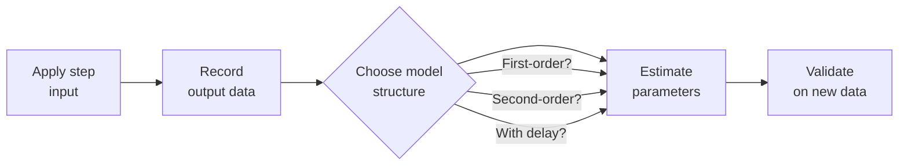

import ModelingSimulationComments from '../../../../components/modeling-and-simulation/ModelingSimulationComments.astro';
import TawkWidget from '../../../../components/TawkWidget.astro';
import UniversalContentContributors from '../../../../components/UniversalContentContributors.astro';
import InArticleAd from '../../../../components/InArticleAd.astro';
import Copyright from '../../../../components/Copyright.astro';
import BionicText from '../../../../components/BionicText.astro';
import TailwindWrapper from '../../../../components/TailwindWrapper.jsx';
import { Tabs, TabItem } from '@astrojs/starlight/components';
import { Card, CardGrid, Badge, Steps, LinkButton, FileTree } from '@astrojs/starlight/components';

<UniversalContentContributors 
  contributors={frontmatter.contributors}
/>


In every previous lesson, you started with a known model and simulated its behavior. Real engineering works the other way around. You have a motor, a thermal system, or a chemical process. You do not know the differential equation. What you can do is poke the system with a known input (a step, a pulse, a chirp), record what comes out, and fit a mathematical model to the data. This is system identification, and it is how control engineers build models of systems they cannot derive from first principles. Once you have the model, you can simulate it, design a controller for it, or predict how it will behave under new conditions. #SystemIdentification #ParameterEstimation #ControlSystems

## The System Identification Workflow

<Card title="From Data to Model" icon="star">
System identification follows a structured process: choose an input signal, excite the system, record input and output data, select a model structure (first-order, second-order, etc.), estimate the parameters using optimization, and validate the model on a separate dataset. The result is a transfer function or state-space model that approximates the real system's behavior.
</Card>



## First-Order System Review

<InArticleAd />


A first-order system has one energy storage element (one capacitor, one thermal mass, one tank). Its step response is an exponential rise or decay characterized by two parameters:

- **Gain** $K$: the ratio of final output change to input change
- **Time constant** $\tau$: the time it takes to reach 63.2% of the final value

The transfer function is:

$$G(s) = \frac{K}{\tau s + 1}$$

The step response (for a unit step at $t = 0$) is:

$$y(t) = K \cdot (1 - e^{-t/\tau})$$

### Recognizing a First-Order Response

When you look at step response data, first-order behavior shows:

- No overshoot (the output approaches the final value monotonically)
- The response is 63.2% complete at $t = \tau$
- The response is 95% complete at $t = 3\tau$
- The response is 99.3% complete at $t = 5\tau$

If you see overshoot or oscillation, the system is at least second-order.

## Second-Order System Review

<InArticleAd />


A second-order system has two energy storage elements. Its behavior depends on two additional parameters:

- **Natural frequency** $\omega_n$: how fast the system oscillates (undamped)
- **Damping ratio** $\zeta$: how quickly oscillations die out

$$G(s) = \frac{K \omega_n^2}{s^2 + 2\zeta\omega_n s + \omega_n^2}$$

The step response depends on $\zeta$:

| Damping ratio | Behavior | Example |
|---------------|----------|---------|
| $\zeta > 1$ | Overdamped, no overshoot | Heavy door closer |
| $\zeta = 1$ | Critically damped, fastest without overshoot | Ideal shock absorber |
| $0 < \zeta < 1$ | Underdamped, oscillates then settles | Spring on a cart |
| $\zeta = 0$ | Undamped, oscillates forever | Ideal pendulum |

## Least Squares Parameter Estimation

<InArticleAd />


Given $N$ measurements $(t_i, y_i)$ and a model $\hat{y}(t; \theta)$ with parameter vector $\theta$, the least squares estimate minimizes:

$$J(\theta) = \sum_{i=1}^{N} (y_i - \hat{y}(t_i; \theta))^2$$

For a first-order step response, $\theta = [K, \tau]$ and $\hat{y}(t; \theta) = K(1 - e^{-t/\tau})$. This is a nonlinear function of $\tau$, so we use nonlinear least squares (e.g., `scipy.optimize.curve_fit`, which uses the Levenberg-Marquardt algorithm internally).

### Why Not Just Read K and Tau from the Plot?

You can estimate $K$ by reading the final value and $\tau$ by finding the 63.2% point. But this manual approach:

- Is inaccurate when the data is noisy
- Does not use all the data points (only two specific values)
- Does not give you confidence intervals
- Does not work well for second-order or higher systems

Least squares fitting uses every data point and produces the parameters that best explain the entire dataset. For the numerical methods behind curve fitting and least squares optimization, see [Applied Mathematics: Numerical Methods and Computation](/education/applied-mathematics/numerical-methods-computation/).

## Project: Black-Box Model Fitter

<InArticleAd />


<Card title="What You Will Build" icon="rocket">
A system identification tool that generates realistic "measured" step response data (with noise and an unknown system), fits both first-order and second-order models, compares the fits, validates on a different input (ramp), and outputs the identified transfer function parameters. The tool is structured so you can replace the simulated data with a real CSV from your sensor.
</Card>

### Complete Runnable Code

```python
import numpy as np
import matplotlib.pyplot as plt
from scipy.optimize import curve_fit
from scipy.integrate import odeint

# ============================================================
# System Identification from Measured Data
# ============================================================
# Generate "measured" step response data from an unknown system,
# fit first-order and second-order models, validate on new input.

np.random.seed(42)

# --- The "real" system (unknown to the identifier) ---
# A second-order underdamped system: motor position control
# Parameters the identifier will try to recover:
TRUE_K = 2.5          # DC gain
TRUE_WN = 4.0         # Natural frequency (rad/s)
TRUE_ZETA = 0.3       # Damping ratio (underdamped)
TRUE_DELAY = 0.15     # Transport delay (seconds)

def true_system_step(t, step_amplitude=1.0):
    """
    True system step response (second-order with delay).
    This simulates what you would measure in a real experiment.
    """
    y = np.zeros_like(t)
    for i, ti in enumerate(t):
        td = ti - TRUE_DELAY
        if td <= 0:
            y[i] = 0.0
        else:
            wd = TRUE_WN * np.sqrt(1 - TRUE_ZETA**2)
            env = np.exp(-TRUE_ZETA * TRUE_WN * td)
            phase = np.arctan2(TRUE_ZETA, np.sqrt(1 - TRUE_ZETA**2))
            y[i] = TRUE_K * step_amplitude * (
                1 - env / np.sqrt(1 - TRUE_ZETA**2) * np.sin(wd * td + phase)
            )
    return y

# --- Generate "measured" data ---
dt = 0.01
t_meas = np.arange(0, 8.0, dt)
step_amplitude = 1.0

# True response + measurement noise
y_true = true_system_step(t_meas, step_amplitude)
noise_std = 0.08
y_meas = y_true + noise_std * np.random.randn(len(t_meas))

print("=" * 65)
print("  System Identification from Measured Step Response")
print("=" * 65)
print(f"  Measurement duration: {t_meas[-1]:.1f} s")
print(f"  Sample rate: {1/dt:.0f} Hz")
print(f"  Noise std: {noise_std}")
print(f"  Step amplitude: {step_amplitude}")
print()
print("  True (hidden) system parameters:")
print(f"    K = {TRUE_K}, wn = {TRUE_WN} rad/s, "
      f"zeta = {TRUE_ZETA}, delay = {TRUE_DELAY} s")
print("-" * 65)

# ============================================================
# Model 1: First-order fit
# ============================================================
def first_order_step(t, K, tau):
    """First-order step response: y = K * (1 - exp(-t/tau))"""
    return K * (1 - np.exp(-t / tau))

# Initial guesses from data inspection
K_guess = y_meas[-100:].mean()  # Final value estimate
tau_guess = 0.5                  # Rough guess

try:
    popt_1st, pcov_1st = curve_fit(
        first_order_step, t_meas, y_meas,
        p0=[K_guess, tau_guess],
        bounds=([0, 0.01], [10, 10]),
        maxfev=10000
    )
    K_1st, tau_1st = popt_1st
    # Confidence intervals (1 sigma)
    perr_1st = np.sqrt(np.diag(pcov_1st))
    y_fit_1st = first_order_step(t_meas, *popt_1st)
    rmse_1st = np.sqrt(np.mean((y_meas - y_fit_1st) ** 2))

    print("\n  First-order fit: G(s) = K / (tau*s + 1)")
    print(f"    K   = {K_1st:.4f}  (+/- {perr_1st[0]:.4f})")
    print(f"    tau = {tau_1st:.4f} s (+/- {perr_1st[1]:.4f})")
    print(f"    RMSE = {rmse_1st:.4f}")
except RuntimeError as e:
    print(f"  First-order fit failed: {e}")
    y_fit_1st = np.zeros_like(t_meas)
    rmse_1st = float('inf')

# ============================================================
# Model 2: Second-order fit
# ============================================================
def second_order_step(t, K, wn, zeta):
    """Second-order underdamped step response."""
    y = np.zeros_like(t)
    for i, ti in enumerate(t):
        if ti <= 0:
            y[i] = 0.0
        elif zeta >= 1.0:
            # Overdamped or critically damped
            s1 = -wn * (zeta + np.sqrt(zeta**2 - 1))
            s2 = -wn * (zeta - np.sqrt(zeta**2 - 1))
            if abs(s1 - s2) > 1e-10:
                y[i] = K * (1 + (s1 * np.exp(s2 * ti) - s2 * np.exp(s1 * ti))
                            / (s2 - s1))
            else:
                y[i] = K * (1 - (1 + wn * ti) * np.exp(-wn * ti))
        else:
            # Underdamped
            wd = wn * np.sqrt(1 - zeta**2)
            env = np.exp(-zeta * wn * ti)
            phase = np.arctan2(zeta, np.sqrt(1 - zeta**2))
            y[i] = K * (1 - env / np.sqrt(1 - zeta**2) * np.sin(wd * ti + phase))
    return y

try:
    popt_2nd, pcov_2nd = curve_fit(
        second_order_step, t_meas, y_meas,
        p0=[K_guess, 3.0, 0.5],
        bounds=([0, 0.1, 0.01], [10, 20, 2.0]),
        maxfev=20000
    )
    K_2nd, wn_2nd, zeta_2nd = popt_2nd
    perr_2nd = np.sqrt(np.diag(pcov_2nd))
    y_fit_2nd = second_order_step(t_meas, *popt_2nd)
    rmse_2nd = np.sqrt(np.mean((y_meas - y_fit_2nd) ** 2))

    print("\n  Second-order fit: G(s) = K*wn^2 / (s^2 + 2*zeta*wn*s + wn^2)")
    print(f"    K    = {K_2nd:.4f}  (+/- {perr_2nd[0]:.4f})")
    print(f"    wn   = {wn_2nd:.4f} rad/s (+/- {perr_2nd[1]:.4f})")
    print(f"    zeta = {zeta_2nd:.4f}  (+/- {perr_2nd[2]:.4f})")
    print(f"    RMSE = {rmse_2nd:.4f}")
except RuntimeError as e:
    print(f"  Second-order fit failed: {e}")
    y_fit_2nd = np.zeros_like(t_meas)
    rmse_2nd = float('inf')

# ============================================================
# Model 3: Second-order with delay
# ============================================================
def second_order_delay_step(t, K, wn, zeta, delay):
    """Second-order underdamped step response with transport delay."""
    y = np.zeros_like(t)
    for i, ti in enumerate(t):
        td = ti - delay
        if td <= 0:
            y[i] = 0.0
        elif zeta >= 1.0:
            s1 = -wn * (zeta + np.sqrt(zeta**2 - 1))
            s2 = -wn * (zeta - np.sqrt(zeta**2 - 1))
            if abs(s1 - s2) > 1e-10:
                y[i] = K * (1 + (s1 * np.exp(s2 * td) - s2 * np.exp(s1 * td))
                            / (s2 - s1))
            else:
                y[i] = K * (1 - (1 + wn * td) * np.exp(-wn * td))
        else:
            wd = wn * np.sqrt(1 - zeta**2)
            env = np.exp(-zeta * wn * td)
            phase = np.arctan2(zeta, np.sqrt(1 - zeta**2))
            y[i] = K * (1 - env / np.sqrt(1 - zeta**2) * np.sin(wd * td + phase))
    return y

try:
    popt_delay, pcov_delay = curve_fit(
        second_order_delay_step, t_meas, y_meas,
        p0=[K_guess, 3.0, 0.5, 0.1],
        bounds=([0, 0.1, 0.01, 0.0], [10, 20, 2.0, 2.0]),
        maxfev=30000
    )
    K_d, wn_d, zeta_d, delay_d = popt_delay
    perr_delay = np.sqrt(np.diag(pcov_delay))
    y_fit_delay = second_order_delay_step(t_meas, *popt_delay)
    rmse_delay = np.sqrt(np.mean((y_meas - y_fit_delay) ** 2))

    print("\n  Second-order + delay fit:")
    print(f"    K     = {K_d:.4f}  (+/- {perr_delay[0]:.4f})")
    print(f"    wn    = {wn_d:.4f} rad/s (+/- {perr_delay[1]:.4f})")
    print(f"    zeta  = {zeta_d:.4f}  (+/- {perr_delay[2]:.4f})")
    print(f"    delay = {delay_d:.4f} s (+/- {perr_delay[3]:.4f})")
    print(f"    RMSE  = {rmse_delay:.4f}")
except RuntimeError as e:
    print(f"  Second-order + delay fit failed: {e}")
    y_fit_delay = np.zeros_like(t_meas)
    rmse_delay = float('inf')

# ============================================================
# Model comparison
# ============================================================
print("\n" + "=" * 65)
print("  Model Comparison")
print("=" * 65)
print(f"  {'Model':<30s} {'RMSE':>10s} {'Parameters':>12s}")
print(f"  {'-'*30} {'-'*10} {'-'*12}")
print(f"  {'First-order':<30s} {rmse_1st:>10.4f} {'2':>12s}")
print(f"  {'Second-order':<30s} {rmse_2nd:>10.4f} {'3':>12s}")
print(f"  {'Second-order + delay':<30s} {rmse_delay:>10.4f} {'4':>12s}")
print(f"  {'Noise floor (theoretical)':<30s} {noise_std:>10.4f} {'':>12s}")
print("=" * 65)
print("\n  The best model has RMSE closest to the noise floor.")
print("  If RMSE >> noise, the model structure is insufficient.")
print("  If RMSE ~ noise, the model captures all systematic behavior.")

# ============================================================
# Validation: test on a ramp input
# ============================================================
print("\n--- Validation on Ramp Input ---")

t_val = np.arange(0, 10.0, dt)
ramp_rate = 0.5  # units/second

# True ramp response (numerical simulation via ODE)
def system_ode(state, t, u_func, K, wn, zeta):
    """ODE for second-order system: K*wn^2 / (s^2 + 2*zeta*wn*s + wn^2)"""
    y, dy = state
    u = u_func(t)
    ddy = K * wn**2 * u - 2 * zeta * wn * dy - wn**2 * y
    return [dy, ddy]

def ramp_input(t):
    """Ramp starting at t=0"""
    return ramp_rate * max(0, t - TRUE_DELAY)

# Simulate the true system with ramp input
y_val_true = odeint(
    system_ode, [0, 0], t_val,
    args=(lambda t: ramp_rate * max(0, t - TRUE_DELAY), TRUE_K, TRUE_WN, TRUE_ZETA)
)[:, 0]
y_val_meas = y_val_true + noise_std * np.random.randn(len(t_val))

# Simulate the identified model with ramp input
if rmse_delay < float('inf'):
    y_val_model = odeint(
        system_ode, [0, 0], t_val,
        args=(lambda t: ramp_rate * max(0, t - delay_d), K_d, wn_d, zeta_d)
    )[:, 0]
    val_rmse = np.sqrt(np.mean((y_val_meas - y_val_model) ** 2))
    print(f"  Ramp validation RMSE: {val_rmse:.4f}")
    print(f"  (Compare to noise floor: {noise_std:.4f})")
    if val_rmse < 2 * noise_std:
        print("  Model validates well on ramp input.")
    else:
        print("  Model shows degraded performance on ramp input.")
else:
    y_val_model = np.zeros_like(t_val)
    val_rmse = float('inf')

# ============================================================
# Plot results
# ============================================================
fig, axes = plt.subplots(2, 2, figsize=(14, 10))

# Plot 1: Measured data and fits
ax = axes[0, 0]
ax.plot(t_meas, y_meas, 'k.', markersize=1, alpha=0.3, label='Measured data')
ax.plot(t_meas, y_true, 'k-', linewidth=2, alpha=0.5, label='True (hidden)')
ax.plot(t_meas, y_fit_1st, 'b--', linewidth=2, label=f'1st order (RMSE={rmse_1st:.3f})')
ax.plot(t_meas, y_fit_2nd, 'r-', linewidth=2, label=f'2nd order (RMSE={rmse_2nd:.3f})')
ax.plot(t_meas, y_fit_delay, 'g-', linewidth=2,
        label=f'2nd + delay (RMSE={rmse_delay:.3f})')
ax.set_xlabel('Time (s)')
ax.set_ylabel('Output')
ax.set_title('Step Response: Data vs Fitted Models')
ax.legend(fontsize=8, loc='lower right')
ax.grid(True, alpha=0.3)

# Plot 2: Residuals
ax = axes[0, 1]
if rmse_delay < float('inf'):
    residuals = y_meas - y_fit_delay
    ax.plot(t_meas, residuals, 'g.', markersize=1, alpha=0.5)
    ax.axhline(0, color='black', linewidth=0.5)
    ax.axhline(noise_std, color='red', linestyle='--', alpha=0.5, label=f'+/- noise std')
    ax.axhline(-noise_std, color='red', linestyle='--', alpha=0.5)
    ax.set_xlabel('Time (s)')
    ax.set_ylabel('Residual')
    ax.set_title('Residuals (Best Model)')
    ax.legend(fontsize=9)
    ax.grid(True, alpha=0.3)

# Plot 3: Validation on ramp
ax = axes[1, 0]
ax.plot(t_val, y_val_meas, 'k.', markersize=1, alpha=0.3, label='Measured (ramp)')
ax.plot(t_val, y_val_true, 'k-', linewidth=2, alpha=0.5, label='True response')
if rmse_delay < float('inf'):
    ax.plot(t_val, y_val_model, 'g-', linewidth=2,
            label=f'Identified model (RMSE={val_rmse:.3f})')
ax.plot(t_val, ramp_rate * np.maximum(0, t_val - TRUE_DELAY), 'gray',
        linestyle=':', label='Ramp input (scaled)')
ax.set_xlabel('Time (s)')
ax.set_ylabel('Output')
ax.set_title('Validation: Ramp Input (Not Used for Fitting)')
ax.legend(fontsize=8, loc='upper left')
ax.grid(True, alpha=0.3)

# Plot 4: Parameter convergence / error bar chart
ax = axes[1, 1]
if rmse_delay < float('inf'):
    param_names = ['K', 'wn', 'zeta', 'delay']
    true_vals = [TRUE_K, TRUE_WN, TRUE_ZETA, TRUE_DELAY]
    est_vals = [K_d, wn_d, zeta_d, delay_d]
    est_errs = [perr_delay[i] for i in range(4)]

    # Normalize: show percentage error
    pct_errors = [100 * abs(e - t) / t for e, t in zip(est_vals, true_vals)]

    bars = ax.bar(param_names, pct_errors, color=['steelblue', 'coral', 'green', 'orange'],
                  alpha=0.7, edgecolor='black')
    ax.set_ylabel('Estimation Error (%)')
    ax.set_title('Parameter Estimation Accuracy')
    ax.grid(True, alpha=0.3, axis='y')

    for bar, pct, est, true in zip(bars, pct_errors, est_vals, true_vals):
        ax.text(bar.get_x() + bar.get_width()/2, bar.get_height() + 0.2,
                f'{est:.3f}\n(true: {true})', ha='center', fontsize=8)

plt.tight_layout()
plt.savefig('system_identification.png', dpi=150, bbox_inches='tight')
plt.show()
print("\nPlot saved: system_identification.png")
```

### How the Code Works

<Steps>

1. **Hidden true system.** A second-order underdamped system with transport delay acts as the "real" physical system. The identifier does not have access to the true parameters. It only sees the noisy output data, just like a real experiment.

2. **Step response measurement.** A step input is applied and the output is recorded with additive Gaussian noise. This simulates what you would get from an oscilloscope or data logger connected to a real system.

3. **Three models are fitted.** A first-order model (2 parameters), a second-order model (3 parameters), and a second-order model with delay (4 parameters). Each uses `scipy.optimize.curve_fit` to minimize the sum of squared residuals.

4. **Model comparison.** The RMSE of each model is compared to the noise floor. The best model should have RMSE close to the noise standard deviation. If a model's RMSE is much higher than the noise, it means the model structure cannot capture the system's behavior.

5. **Cross-validation.** The best model is tested on a ramp input that was not used during fitting. If the model generalizes well to new inputs, the identification is successful. If it fails on the ramp, the model may be overfitting to the step response shape.

6. **Parameter accuracy.** The error bar chart shows how close each estimated parameter is to the true value. With sufficient data and appropriate model structure, the estimates should be within a few percent of truth.

</Steps>

## Residual Analysis

<InArticleAd />


The residuals (measured minus predicted) tell you whether your model is adequate:

| Residual Pattern | Interpretation |
|-----------------|----------------|
| Random scatter around zero | Good fit. Remaining error is just noise. |
| Systematic trend | Model structure is wrong (missing dynamics) |
| Large at early times | Delay or initial conditions are wrong |
| Growing over time | Unstable model or missing slow dynamics |
| Oscillating | Missing a resonant mode |

If the residuals look random and their standard deviation matches the known noise level, you have extracted all the information the data contains.

## Using Your Own Data

<InArticleAd />


To use real measured data instead of simulated data, replace the data generation section with:

```python
# Load your own step response data
import csv

def load_csv_data(filename):
    """Load time and output columns from a CSV file."""
    t_data = []
    y_data = []
    with open(filename, 'r') as f:
        reader = csv.reader(f)
        next(reader)  # skip header
        for row in reader:
            t_data.append(float(row[0]))
            y_data.append(float(row[1]))
    return np.array(t_data), np.array(y_data)

# t_meas, y_meas = load_csv_data('my_step_response.csv')
```

The rest of the fitting code works without modification. You will need to adjust the initial guesses (`p0`) and bounds based on what you expect the system to look like.

## Connecting to PID Control

<InArticleAd />


Once you have identified the transfer function, you can use it directly in a PID simulator. For example, with the identified parameters $K$, $\omega_n$, and $\zeta$:

<Steps>

1. Build the transfer function model in Python or MATLAB

2. Apply Ziegler-Nichols or other tuning rules to compute PID gains

3. Simulate the closed-loop response to verify stability and performance

4. Deploy the PID gains to your microcontroller

5. If the real system does not match the simulation, re-identify with new data

</Steps>

This is the standard model-based control design workflow. System identification is the first step.

## Practical Tips

<InArticleAd />


### Choosing the Input Signal

A step input is the simplest and most common choice, but other inputs can be more informative:

| Input Type | Advantage | Disadvantage |
|-----------|-----------|--------------|
| Step | Simple, reveals time constant and gain directly | Poor frequency resolution |
| Impulse | Rich frequency content | Hard to apply cleanly in practice |
| Chirp (swept sine) | Uniform excitation across frequency range | Requires longer experiment |
| PRBS (pseudo-random binary) | Broadband, statistical properties well known | Harder to interpret visually |

### Signal-to-Noise Ratio

Make the step large enough that the system response is clearly visible above the noise. A rule of thumb: the step response amplitude should be at least 10 times the noise standard deviation. If you cannot make the step larger (physical constraints), average multiple step responses to reduce noise.

### How Much Data Is Enough

Record data for at least 5 time constants ($5\tau$) so that the response reaches steady state. For a second-order underdamped system, record long enough for the oscillations to die out (at least $5 / (\zeta \omega_n)$ seconds). More data generally improves the fit, but only up to the point where the model structure is the limiting factor rather than noise.

## Exercises

<InArticleAd />


1. **Noise sensitivity.** Increase the noise standard deviation from 0.08 to 0.5. How do the parameter estimates change? At what noise level does the second-order fit become unreliable?

2. **Wrong model structure.** Try fitting a first-order model to data generated by a third-order system. What do the residuals look like? Can you detect the model inadequacy from the residuals alone?

3. **Overdamped system.** Change the true system to $\zeta = 1.5$ (overdamped). Does the fitter correctly identify it as overdamped? How does the first-order fit compare now?

4. **Real data.** Record the step response of a physical system: a DC motor's speed response to a voltage step, a thermistor's response to a heat lamp, or an RC circuit measured with an oscilloscope. Load the CSV and run the fitter. What model order do you need?

5. **Frequency domain identification.** Instead of fitting in the time domain, compute the FFT of the input and output, take the ratio to get the frequency response, and fit the transfer function magnitude and phase. Compare the results to the time-domain fit.

## References

<InArticleAd />


- Ljung, L. (1999). *System Identification: Theory for the User*. Prentice Hall. The standard reference for system identification theory.
- Astrom, K. J. and Murray, R. M. (2021). *Feedback Systems: An Introduction for Scientists and Engineers*. Princeton University Press. Free online: [fbswiki.org](http://www.fbswiki.org). Chapters on modeling from data.
- SciPy `curve_fit` documentation: [docs.scipy.org/doc/scipy/reference/generated/scipy.optimize.curve_fit.html](https://docs.scipy.org/doc/scipy/reference/generated/scipy.optimize.curve_fit.html)
- Nise, N. S. (2019). *Control Systems Engineering*. Wiley. Good coverage of transfer functions and time-domain specifications.


<InArticleAd />
<ModelingSimulationComments />
<TawkWidget />
<Copyright />